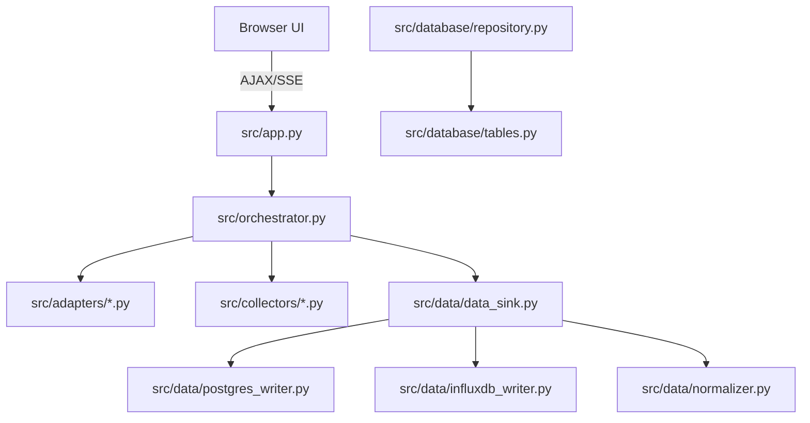
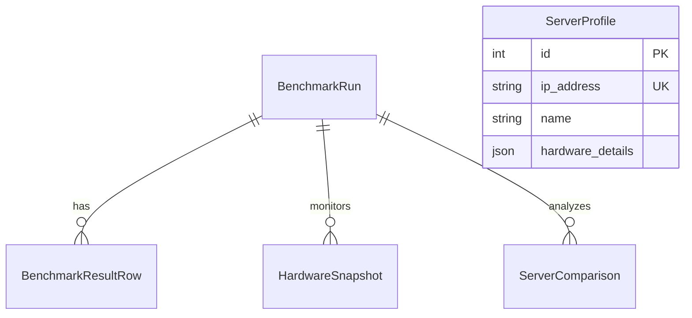
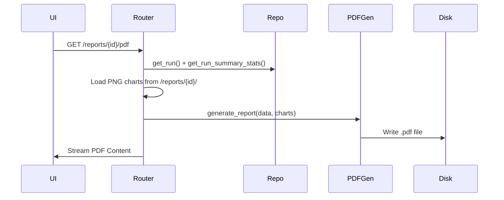

# CODE STRUCTURE DOCUMENTATION

## 1. Overview
- **Tech Stack:** Python 3.13+, FastAPI, SQLAlchemy (PostgreSQL), InfluxDB, Grafana, Jinja2, Tailwind CSS.
- **Pattern:** Adapter Pattern (Benchmarks), Repository Pattern (DB), Orchestrator (Workflow Control).
- **Entry Points:** `src/app.py` (Web), `src/__main__.py` (CLI), `src/background.py` (Background Sync).
- **Purpose:** A mission-critical system for benchmarking, monitoring, and comparing AI Server performance across varied environments.

## 2. Business Logic & Context (The "Why")

The **Benchmark AI Server System** is designed to compare LLM inference performance across multiple, dynamically configured environments:

- **Dynamic Servers:** Users can add unlimited servers via the Server Management UI, allowing multi-way comparison (e.g. up to 3 servers concurrently).
- **Core Goal:** To benchmark raw hardware performance vs optimized configurations (like aiDaptive+) and establish clear, empirical performance gains.

### 2.1 Core Metrics
| Metric | Full Name | Description |
|:---|:---|:---|
| **TTFT** | Time To First Token | Latency until the first token is generated (ms). |
| **TPS** | Tokens Per Second | Generation speed (throughput). |
| **TPOT** | Time Per Output Token | Average time spent per generated token. |
| **ITL** | Inter-Token Latency | Latency between consecutive tokens. |
| **RPS** | Requests Per Second | Request-level throughput. |
| **Error Rate** | Failure Rate | Percentage of failed inference requests. |

### 2.2 Main Features
- **Server Monitoring:** Auto-scans hardware (GPU, CPU, VRAM) via remote agents.
- **Multi-tool Benchmark:** Supports 7 tools (Ollama, Oha, K6, Locust, LLMPerf, vLLM, LiteLLM).
- **Automated Comparison:** Calculates Δ% (Delta) between servers to determine the winner.
- **Reporting:** Generates real-time charts (Chart.js) and downloadable PDF/CSV reports.

---

## 3. System Configuration (`benchmark.yaml`)

The system's behavior is driven by `benchmark.yaml` (for static configs like environments/models) and the **PostgreSQL Database** (for dynamic Server Profiles). Key sections include:

- **`servers`:** (Migrated to DB) Managed via the Web UI (`server_profiles` table). Supports IP-based resolution and hardware auto-discovery.
- **`models`:** List of LLM models available for benchmarking (e.g., `llama3.2:latest`).
- **`benchmark.test_suites`:** 
    - `single_request`: Measures per-request latency across scenarios (chat, code, etc.).
    - `concurrency_scaling`: Measures metrics across levels (1, 8, 16, 32, 64, 256).
    - `concurrent_load`: Measures RPS and P99 latency under heavy load.
- **`tools`:** Enables/disables specific benchmark adapters.

---

## 4. UI & Presentation Map (`templates/`)

The frontend uses **Jinja2** templates with **Tailwind CSS**. All templates extend `base.html`.

| Template | Purpose |
|:---|:---|
| `base.html` | Core layout, navigation, and global JS/CSS dependencies. |
| `dashboard.html` | Main overview with recent runs, total stats, and TPS trends. |
| `servers.html` | Data Table for CRUD operations on dynamic Server Profiles. |
| `benchmark.html` | Form to configure and start a new benchmark run. |
| `history.html` | Paginated list of all past benchmark runs. |
| `run_detail.html` | Detailed results for a specific run, including comparison tables and Chart.js visualizations. |
| `comparison.html` | Side-by-side comparison of two different benchmark runs. |
| `report_details.html` | Specialized view for generating/viewing PDF report summaries. |

---

## 5. Directory Map

| Folder/File | Description |
|:---|:---|
| `src/app.py` | Main Web Application; handles routing, Jinja2 rendering, and background task initialization. |
| `src/orchestrator.py` | **Core Lifecycle Controller**; manages Preflight, Warmup, Monitoring, and Execution phases. |
| `src/adapters/` | Tool abstraction layer; contains `ollama`, `oha`, `k6`, `locust`, `llmperf`, `vllm_bench` adapters. |
| `src/collectors/` | Connectivity layer; probes remote agents and polls hardware metrics in background threads. |
| `src/data/` | Data pipeline; handles normalization, aggregation, and multi-backend broadcasting. |
| `src/database/` | Storage layer; defines ORM models, session management, and CRUD repositories. |
| `src/reports/` | Intelligence layer; generates PDF reports and Matplotlib/Plotly visualizations. |
| `src/i18n.py` | Localization; central repository for EN, VI, ZH translations for UI and PDF. |

## 6. Module Dependency Graph

## 7. File-to-File Relationship Map (100% Coverage)

| File | Imports From | Imported By |
|:---|:---|:---|
| `src/app.py` | `orchestrator`, `repository`, `discovery`, `i18n`, `config`, `engine` | `src/routers/reports.py` |
| `src/orchestrator.py` | `adapters/*`, `agent_client`, `metric_collector`, `data_sink`, `aggregator` | `app.py`, `__main__.py` |
| `src/collectors/agent_client.py` | `httpx`, `models` | `orchestrator`, `metric_collector`, `background` |
| `src/collectors/metric_collector.py` | `agent_client`, `data_sink` | `orchestrator` |
| `src/data/data_sink.py` | `influxdb_writer`, `postgres_writer`, `normalizer`, `repository` | `orchestrator`, `metric_collector` |
| `src/database/repository.py` | `tables`, `time_utils` | `app.py`, `data_sink`, `aggregator`, `routers/reports.py` |
| `src/reports/pdf_generator.py` | `reportlab`, `time_utils` | `src/routers/reports.py` |
| `src/background.py` | `agent_client`, `seed` | `app.py` |

## 8. Function Cross-Reference Map

### 📄 src/collectors/metric_collector.py
- **`start()`**: Spawns background thread `_run_loop()`. Called by `Orchestrator.run_async()`.
- **`stop()`**: Sets `_running=False` and joins thread. Called by `Orchestrator.run_async()`.
- **`_run_loop()`**: Creates asyncio loop for `_async_loop()`.
- **`_async_loop()`**: **Calls →** `agent.get_all_metrics()`, `sink.write_hardware_metrics()`. **Output:** Periodic metrics stream.

### 📄 src/collectors/agent_client.py
- **`get_all_metrics()`**: **Calls →** `/metrics/gpu`, `/metrics/system` on remote agent. **Output:** `HardwareMetrics` object.
- **`warmup_model(model)`**: **Calls →** `/api/generate` (Ollama) 3 times. **Side Effect:** Loads model weights into GPU VRAM.
- **`check_agent_health()`**: Probes `/health`. **Output:** `bool`.

### 📄 src/data/aggregator.py
- **`generate_comparisons(run_id)`**: **Calls →** `repo.get_aggregated_results()`. **Side Effect:** Inserts into `server_comparisons` table.

### 📄 src/database/repository.py
- **`create_run(run_id, **kwargs)`**: **Output:** `BenchmarkRun` object. **Side Effect:** SQL INSERT.
- **`list_runs(limit, offset)`**: **Output:** `List[BenchmarkRun]`. Sorted by `started_at` DESC.
- **`get_run_summary_stats(run_id)`**: **Output:** `dict` (Aggregated AVG/SUM). Used for Dashboard rendering.

### 📄 src/reports/pdf_generator.py
- **`generate_report(...)`**: **Calls →** `reportlab` canvas. **Side Effect:** Writes `.pdf` file to `reports/` directory.

## 9. Interface / Abstract Map

| Interface | Method | OllamaAdapter Implementation | Oha / K6 / Locust Implementation |
|:---|:---|:---|:---|
| `BaseToolAdapter` | `run(prompts)` | Native Python loop with `httpx` | Spawns Subprocess ([TODO: needs verify binary path]) |
| | `is_available()` | Always `True` | `shutil.which(binary)` check |

## 10. Endpoints / Routes

| Method | Route | Handler | Description |
|:---|:---|:---|:---|
| GET | `/` | `page_dashboard` | Dashboard with 4 summary queries. |
| POST | `/api/benchmark/start` | `api_benchmark_start` | Triggers `Orchestrator` async task. |
| GET | `/api/runs/{run_id}/export`| `api_export_csv` | Streams database rows as CSV attachment. |

## 11. Data Models (ER Diagram)

## 12. Core Business Flows

### Flow 1: PDF Report Generation

### Flow 2: Dashboard Load (GET /)
1. `App` calls `repo.list_runs(limit=10)` for "Recent Runs" table.
2. `App` calls `repo.count_runs()` for "Total Benchmarks" card.
3. `App` calls `repo.list_server_profiles()` to show Current Node Health.
4. `Jinja2` renders `dashboard.html` with combined data object.

### Flow 3: CSV Export
1. `UI` triggers Download → `App` calls `repo.get_results_by_run(run_id)`.
2. `App` uses `io.StringIO` and `csv.writer` to format rows.
3. `App` returns `StreamingResponse` for memory efficiency.

## 13. Connections & Environment (benchmark.yaml)
- **InfluxDB:** Token-based auth. [TODO: verify if bucket auto-creates].
- **Grafana:** Integration via direct link on Dashboard.
- **Config:** `benchmark.concurrency_levels` defines the scaling X-axis for all charts.

## 14. Shared Utils (Scanned & Verified)
- **`get_local_time()`**: Used in 12+ files (Repository, Collectors, Seed, etc.).
- **`translate(lang, key)`**: Used in Template Context, PDF Generator, and API Error handling.
- **`load_config(path)`**: Used in `app.py`, `__main__.py`, `background.py`, and `seed.py`.
- **`Database.get_sync_session()`**: Used in `Orchestrator`, `DataSink`, `Aggregator`, and `Seed`.

