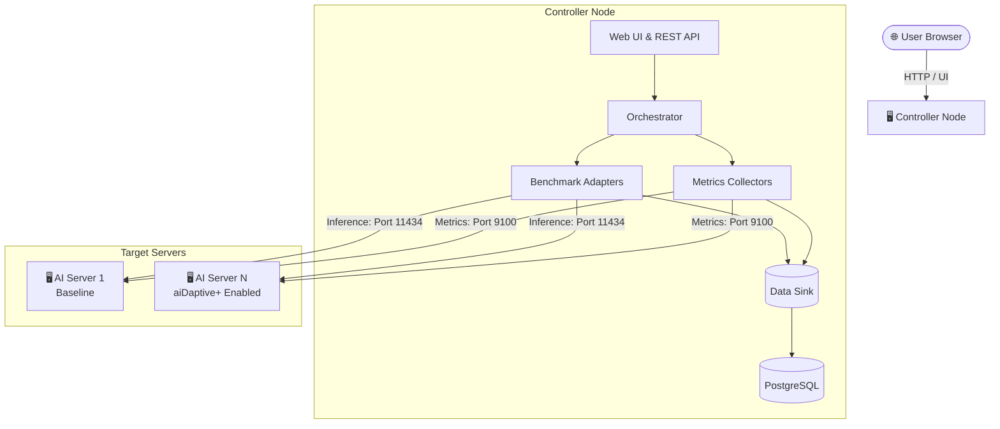
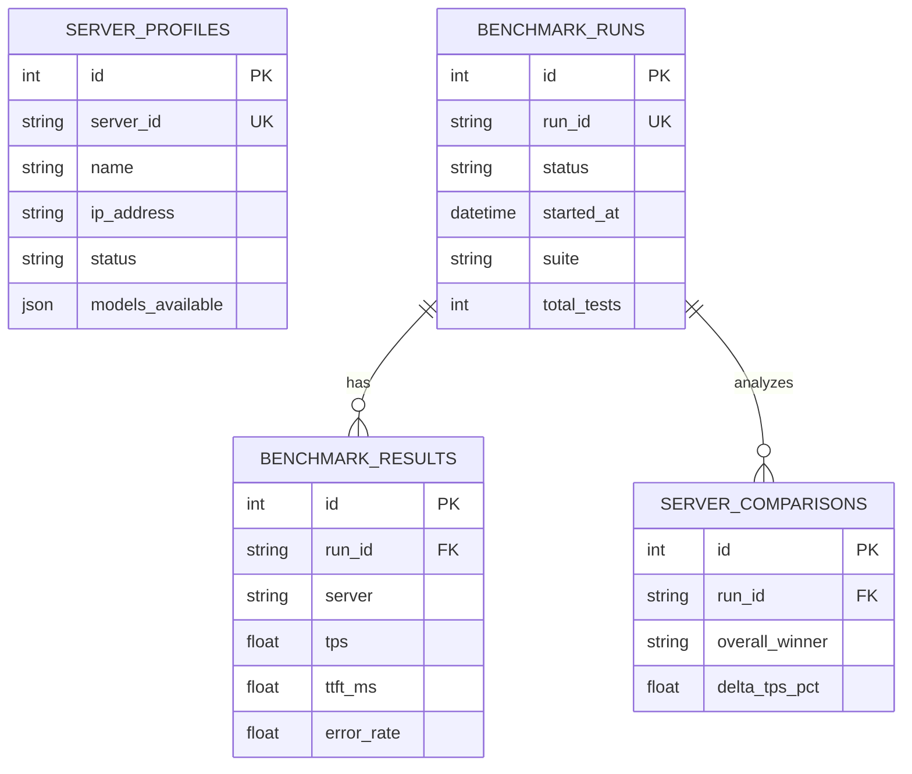
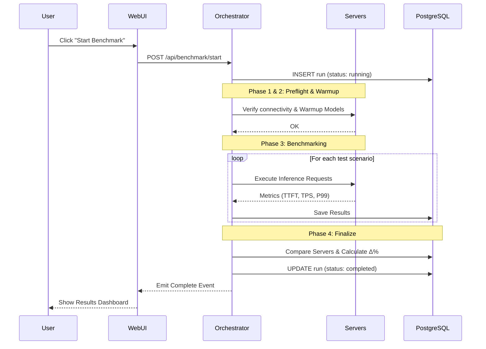

<div align="center">
  <h1>🚀 aiDaptive Benchmark Suite v2.0</h1>
  <p><b>A professional, dynamic, and multi-server LLM inference benchmarking platform.</b></p>
  
  [](#)
  [](#)
  [](#)
  [](#)
  [](#)
</div>

---

## 📖 Overview

**aiDaptive Benchmark Suite** is an advanced AI performance measurement tool that allows you to configure and compare LLM inference performance across multiple servers dynamically.

### 🎯 Core Objectives
- Flexible management of unlimited servers via a dynamic Data Table UI.
- Concurrent benchmarking across 1 to N servers.
- **Hardware vs. Optimized Comparison:** Prove empirical performance gains by comparing raw hardware (Baseline) against optimized configurations (aiDaptive+ Enabled).

---

## ✨ Key Features

| Feature | Description |
| :--- | :--- |
| 🖥️ **Server Monitoring** | Auto-scans hardware and monitors real-time system status. |
| 🛠️ **Multi-tool Benchmark**| Native support for 7 benchmarking tools (Ollama, Oha, K6, Locust, LLMPerf, vLLM, LiteLLM). |
| ⚖️ **Automated Comparison** | Automatically calculates `Δ%` (Delta) to determine the absolute performance winner. |
| 📊 **Built-in Visualization**| Interactive Chart.js integration right in the UI—no Grafana needed. |
| 📑 **History & Reports** | Persistent run history with PDF/CSV export capabilities. |
| 📝 **Prompt Scenarios** | Diverse test scenarios including chat, coding, and long-context outputs. |

---

## 📈 Core Metrics

| Metric | Full Name | Unit | Description |
| :---: | :--- | :---: | :--- |
| **TTFT** | Time To First Token | `ms` | Latency until the first token is generated. |
| **TPOT** | Time Per Output Token | `ms` | Average time spent generating each subsequent token. |
| **TPS** | Tokens Per Second | `tokens/s` | Token generation speed (throughput). |
| **ITL** | Inter-Token Latency | `ms` | Latency between consecutive tokens. |
| **RPS** | Requests Per Second | `req/s` | Number of requests handled per second. |
| **P50/P95/P99** | Latency Percentiles | `ms` | Percentile distribution of latency. |
| **Error Rate** | Failure Rate | `%` | Percentage of failed inference requests. |

---

## 🏗️ System Architecture



---

## 🗄️ Database Design



---

## 🔄 Benchmark Execution Flow



---

## 🚀 Getting Started

### 1. Prerequisites
- **Python 3.10+**
- **Docker & Docker Compose**
- **PostgreSQL 15+**

### 2. Installation
```bash
# Clone the repository
git clone https://github.com/MrPhuocTan/aidaptive-benchmark.git
cd aidaptive-benchmark

# Start the database
docker-compose up -d

# Install dependencies
python -m venv .venv
source .venv/bin/activate
pip install -r requirements.txt

# Start the server
python -m src
```
*Access the Web UI at `http://localhost:8000`*

---

## 🤝 Support & Contact
For inquiries and support, please contact the engineering team.

*aiDaptive Benchmark Suite v2.0 - © 2024 aiDaptive Inc. All rights reserved.*
