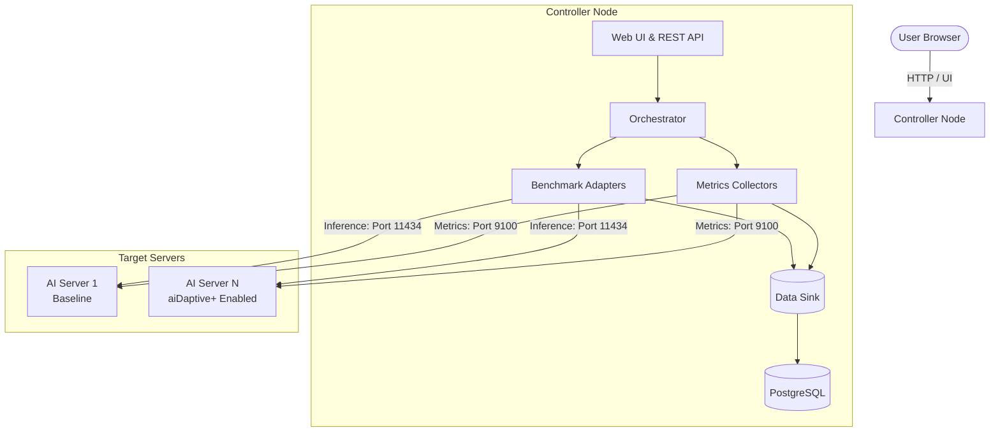
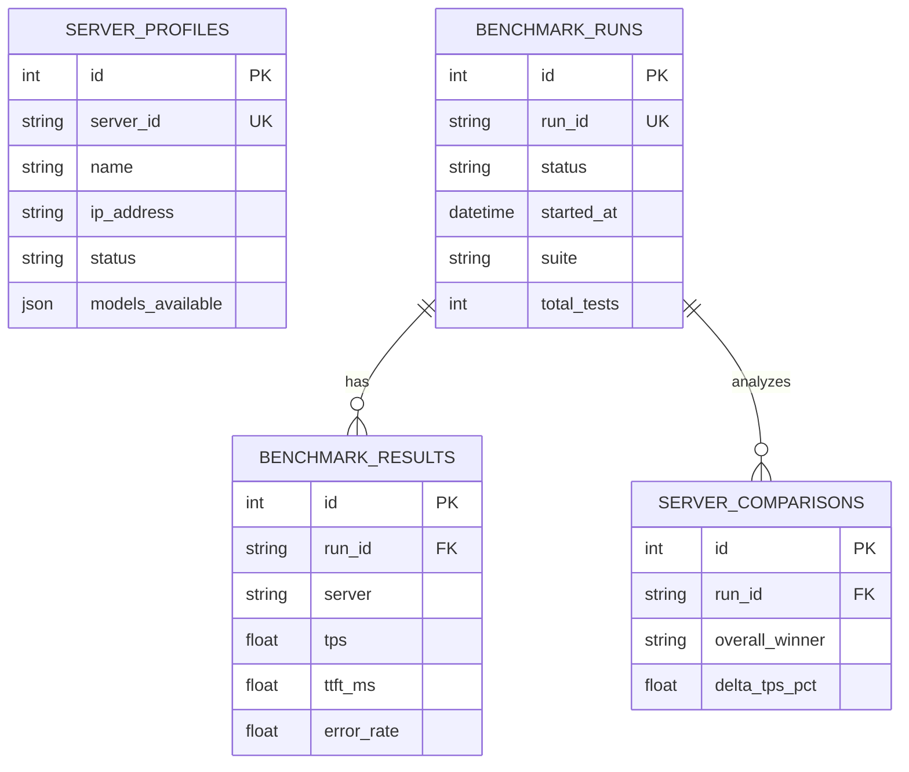
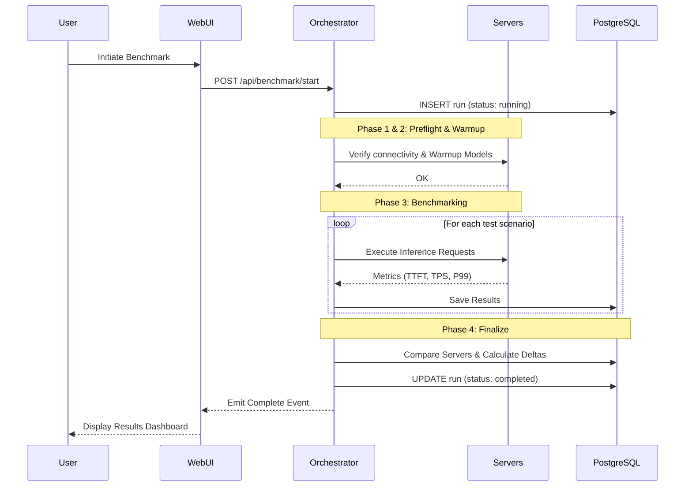

<div align="center">
  <h1>aiDaptive Benchmark Suite</h1>
  <p><b>A professional, dynamic, and multi-server LLM inference benchmarking platform.</b></p>
  
  [](#)
  [](#)
  [](#)
  [](#)
  [](#)
</div>

---

## Overview

The **aiDaptive Benchmark Suite** is an advanced AI performance measurement tool designed to configure and compare LLM inference performance across multiple servers dynamically.

### Core Objectives
- Flexible management of unlimited servers via a dynamic Data Table UI.
- Concurrent benchmarking execution across multiple target environments.
- **Hardware vs. Optimized Comparison:** Empirical performance validation comparing raw hardware configurations (Baseline) against optimized configurations (aiDaptive+ Enabled).

---

## Key Features

| Feature | Description |
| :--- | :--- |
| **Server Monitoring** | Automated hardware scanning and real-time system status tracking. |
| **Multi-tool Benchmark**| Native support for 7 benchmarking tools (Ollama, Oha, K6, Locust, LLMPerf, vLLM, LiteLLM). |
| **Automated Comparison** | Automatic calculation of performance differentials (`Δ%`) to determine the optimal configuration. |
| **Built-in Visualization**| Interactive Chart.js integration embedded directly within the user interface. |
| **History & Reports** | Persistent test execution history with comprehensive PDF/CSV export capabilities. |
| **Prompt Scenarios** | Diverse testing scenarios including conversational, coding, and long-context outputs. |

---

## Core Metrics

| Metric | Full Name | Unit | Description |
| :---: | :--- | :---: | :--- |
| **TTFT** | Time To First Token | `ms` | Latency measured until the generation of the first token. |
| **TPOT** | Time Per Output Token | `ms` | Average time required to generate each subsequent token. |
| **TPS** | Tokens Per Second | `tokens/s` | Token generation throughput speed. |
| **ITL** | Inter-Token Latency | `ms` | Latency delay between consecutive tokens. |
| **RPS** | Requests Per Second | `req/s` | Processing volume of requests handled per second. |
| **P50/P95/P99** | Latency Percentiles | `ms` | Percentile distribution thresholds of inference latency. |
| **Error Rate** | Failure Rate | `%` | Percentage metric of failed inference requests. |

---

## System Architecture



---

## Database Design



---

## Benchmark Execution Flow



---

## Getting Started

### 1. Prerequisites
- **Python 3.10+**
- **Docker & Docker Compose**
- **PostgreSQL 15+**

### 2. Installation
```bash
# Clone the repository
git clone https://github.com/MrPhuocTan/aidaptive-benchmark.git
cd aidaptive-benchmark

# Start the database
docker-compose up -d

# Install dependencies
python -m venv .venv
source .venv/bin/activate
pip install -r requirements.txt

# Start the application server
python -m src
```
*The Web UI will be accessible at `http://localhost:8443`*

---

## Support & Contact
For platform inquiries, infrastructure support, or architectural discussions, contact the engineering team.

*aiDaptive Benchmark Suite v2.0 - © 2024 aiDaptive Inc. All rights reserved.*
